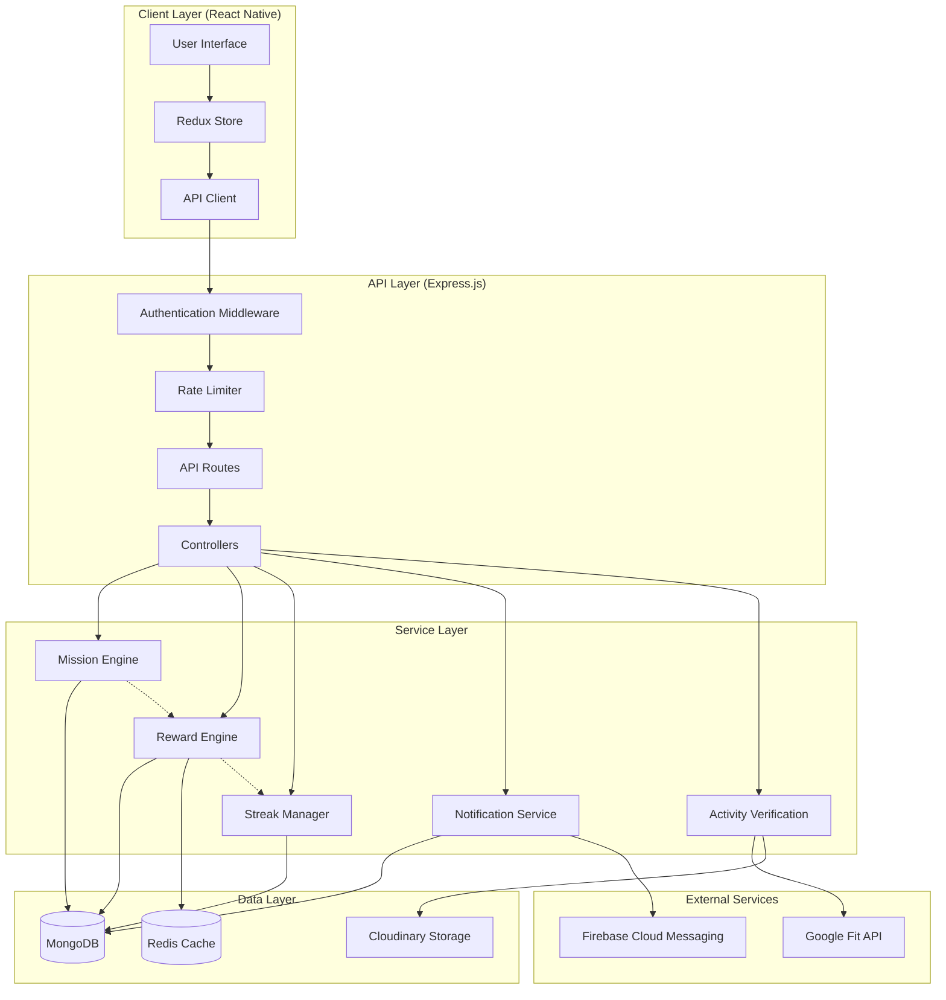
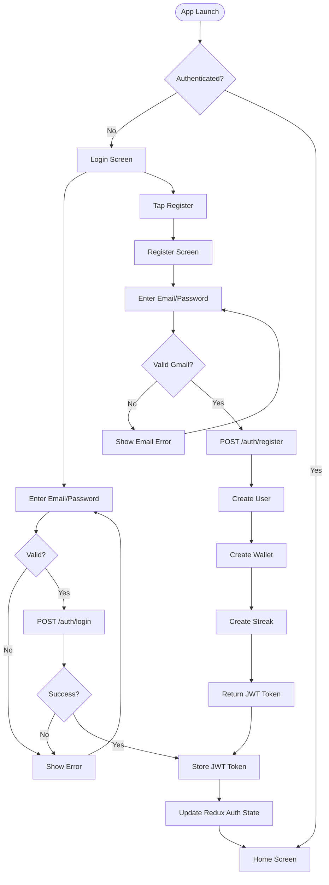
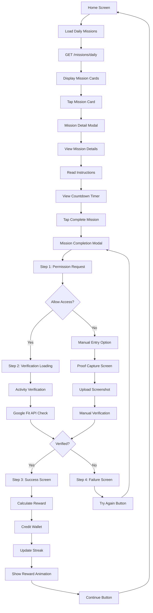
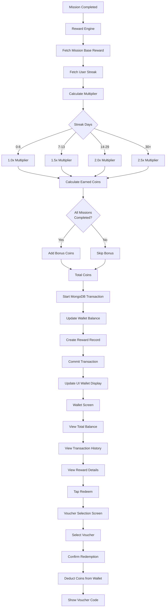
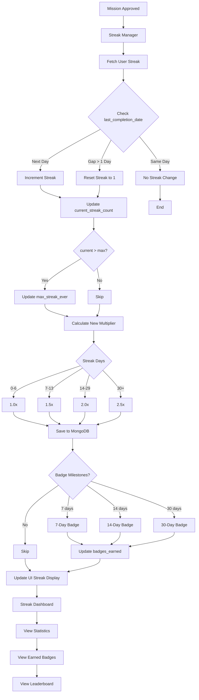
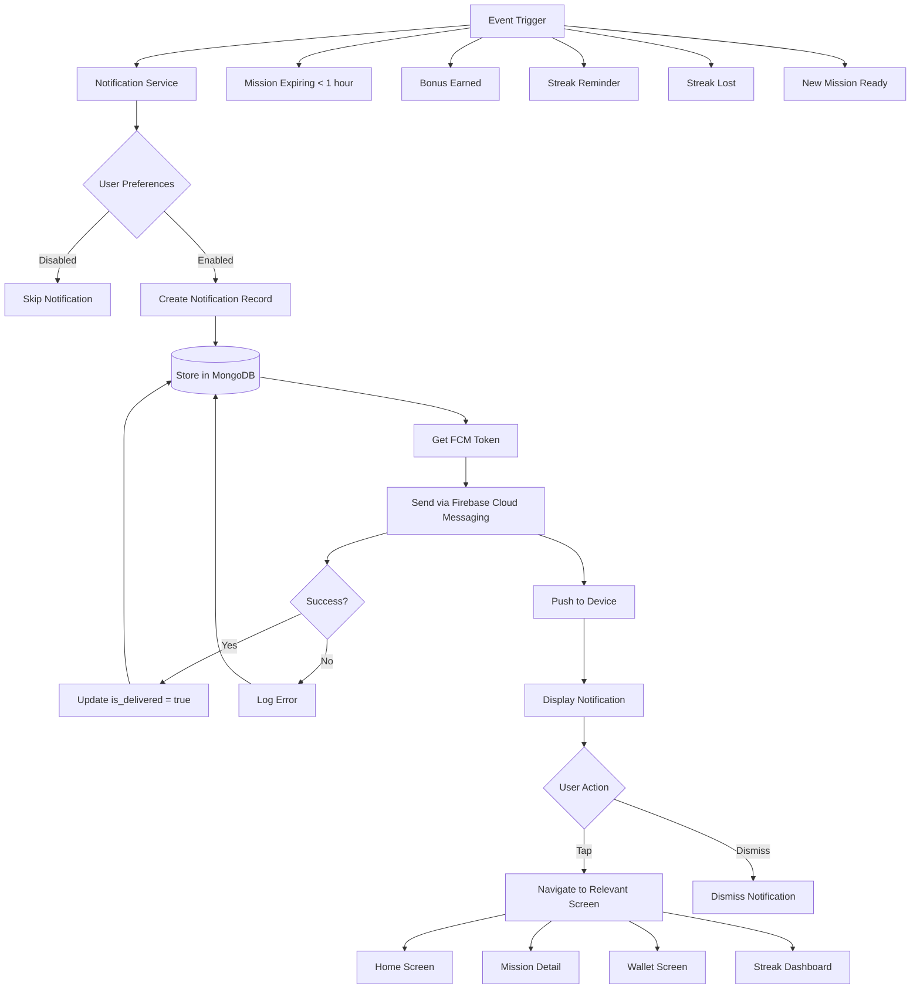
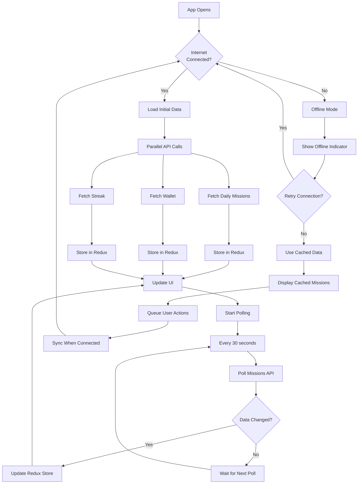

# Architecture Documentation

## Table of Contents
1. [ERD (Entity Relationship Diagram)](#erd-entity-relationship-diagram)
2. [DRD (Data Relationship Diagram)](#drd-data-relationship-diagram)
3. [User Journey / Flow Diagrams](#user-journey--flow-diagrams)

---

## ERD (Entity Relationship Diagram)

### Database Schema Overview

The application uses MongoDB with Mongoose ODM. The following entities and their relationships are defined:

```mermaid
erDiagram
    USER ||--o{ MISSION_ATTEMPT : "creates"
    USER ||--|| WALLET : "has"
    USER ||--|| STREAK : "has"
    USER ||--o{ PHONE_ACTIVITY : "tracks"
    USER ||--o{ NOTIFICATION : "receives"
    
    MISSION ||--o{ MISSION_ATTEMPT : "has"
    MISSION_ATTEMPT ||--o{ REWARD : "generates"
    
    WALLET ||--o{ REWARD : "contains"
    STREAK ||--o{ REWARD : "affects"

    USER {
        string user_id PK
        string email UK
        string username
        string password_hash
        string timezone
        date created_at
        date last_activity_at
        boolean is_active
        string fcm_token
        string device_fingerprint
        string current_device_id
        object preferences
    }

    MISSION {
        string mission_id PK
        string title
        string description
        string difficulty
        number base_reward
        string requirement_type
        number requirement_value
        date created_at
        date expires_at
        string proof_requirement
        boolean is_active
        object metadata
    }

    MISSION_ATTEMPT {
        string attempt_id PK
        string user_id FK
        string mission_id FK
        date submitted_at
        date completed_at
        object proof
        string verification_status
        number fraud_score
        object api_response
        string notes
    }

    REWARD {
        string reward_id PK
        string user_id FK
        string attempt_id FK
        number amount
        string type
        string source
        date created_at
        boolean is_credited
        string reason
    }

    WALLET {
        string wallet_id PK
        string user_id FK UK
        number total_balance
        date updated_at
        string currency
        array transaction_history
    }

    STREAK {
        string streak_id PK
        string user_id FK UK
        number current_streak_count
        number max_streak_ever
        date last_completion_date
        date streak_started_at
        number multiplier
        array badges_earned
    }

    PHONE_ACTIVITY {
        string activity_id PK
        string user_id FK
        string date
        number total_seconds
        number sessions
        object device_info
        date last_updated
        date synced_at
    }

    NOTIFICATION {
        string notification_id PK
        string user_id FK
        string type
        date sent_at
        string fcm_token
        boolean is_delivered
        object metadata
    }
```

### Entity Relationships

#### 1. User Relationships
- **User → Wallet**: One-to-One (1:1)
  - Each user has exactly one wallet
  - Wallet is created automatically on user registration
  
- **User → Streak**: One-to-One (1:1)
  - Each user has exactly one streak record
  - Streak is created automatically on user registration

- **User → MissionAttempt**: One-to-Many (1:N)
  - A user can create multiple mission attempts
  - Each attempt is linked to a specific mission

- **User → PhoneActivity**: One-to-Many (1:N)
  - A user can have multiple phone activity records (one per day)
  - Unique constraint on (user_id, date)

- **User → Notification**: One-to-Many (1:N)
  - A user can receive multiple notifications

#### 2. Mission Relationships
- **Mission → MissionAttempt**: One-to-Many (1:N)
  - A mission can have multiple attempts from different users
  - Each attempt represents a user's completion attempt

#### 3. MissionAttempt Relationships
- **MissionAttempt → Reward**: One-to-Many (1:N)
  - Each approved attempt generates one or more rewards
  - Rewards can be mission completion coins, streak bonuses, or all-missions bonuses

#### 4. Wallet Relationships
- **Wallet → Reward**: One-to-Many (1:N)
  - Wallet contains transaction history referencing reward IDs
  - Wallet balance is updated when rewards are credited

#### 5. Streak Relationships
- **Streak → Reward**: Indirect (affects multiplier)
  - Streak count determines reward multiplier
  - Multiplier affects reward calculation in RewardEngine

### Key Indexes

```javascript
// User indexes
{ email: 1 } - Unique
{ created_at: 1 }
{ last_activity_at: 1 }

// Mission indexes
{ expires_at: 1 } - TTL index (expires after 86400 seconds)
{ is_active: 1, expires_at: 1 } - Compound

// MissionAttempt indexes
{ user_id: 1, mission_id: 1, submitted_at: 1 } - Compound
{ verification_status: 1, submitted_at: 1 } - Compound

// Reward indexes
{ user_id: 1, created_at: -1 }
{ is_credited: 1 }

// Wallet indexes
{ user_id: 1 } - Unique

// Streak indexes
{ user_id: 1 } - Unique
{ last_completion_date: 1 }

// PhoneActivity indexes
{ user_id: 1, date: 1 } - Unique compound

// Notification indexes
{ user_id: 1, is_delivered: 1 }
{ sent_at: 1 }
```

---

## DRD (Data Relationship Diagram)

### Data Flow Architecture



### Data Flow Patterns

#### 1. Mission Retrieval Flow
```
User Request → API Client → GET /missions/daily
  → MissionController.getDailyMissions()
  → MissionEngine.getDailyMissions(userId)
  → MongoDB Query (Mission collection)
  → Calculate time remaining
  → Return enriched mission data
  → Redux Store (missionSlice)
  → UI Update
```

#### 2. Mission Completion Flow
```
User Action → API Client → POST /missions/:id/complete
  → Authentication Middleware (verify JWT)
  → Rate Limiter (prevent abuse)
  → Upload Middleware (handle proof image)
  → Cloudinary Upload
  → MissionController.completeMission()
  → MissionEngine.createAttempt()
  → MongoDB Insert (MissionAttempt)
  → ActivityVerification.verify()
  → Google Fit API (if API_VERIFICATION)
  → RewardEngine.calculateReward()
  → RewardEngine.creditReward()
  → MongoDB Transaction:
    - Update Wallet (total_balance)
    - Insert Reward record
  → StreakManager.incrementStreak()
  → MongoDB Update (Streak)
  → NotificationService.sendCompletionNotification()
  → FCM Push Notification
  → Return success response
  → Redux Store Update
  → UI Success Animation
```

#### 3. Reward Calculation Flow
```
Mission Completion → RewardEngine.calculateReward()
  → Fetch Mission (base_reward)
  → Fetch Streak (current_streak_count)
  → Calculate Multiplier:
    - 1.0x (0-6 days)
    - 1.5x (7-13 days)
    - 2.0x (14-29 days)
    - 2.5x (30+ days)
  → Calculate earned_coins = base_reward × multiplier
  → Check if all missions completed
  → Add bonus_coins if applicable
  → Return reward calculation object
```

#### 4. Wallet Update Flow
```
Reward Credit → RewardEngine.creditReward()
  → Start MongoDB Transaction
  → Fetch/Create Wallet
  → Update total_balance += total_coins
  → Push reward_id to transaction_history
  → Insert Reward record
  → Commit Transaction
  → Return updated wallet
```

#### 5. Streak Management Flow
```
Mission Approved → StreakManager.incrementStreak()
  → Fetch Streak record
  → Check last_completion_date
  → If same day: No change
  → If next day: Increment streak
  → If gap > 1 day: Reset streak
  → Update multiplier based on streak count
  → Update max_streak_ever if needed
  → Save to MongoDB
```

### Data Synchronization

#### Real-time Updates
- **Missions**: Polled every 30 seconds on HomeScreen
- **Wallet**: Updated immediately after reward credit
- **Streak**: Updated immediately after mission completion
- **Notifications**: Pushed via FCM, stored in MongoDB

#### Caching Strategy
- **Redis**: Used for rate limiting and session management
- **Redux**: Client-side state management for UI updates
- **MongoDB**: Primary data store with TTL indexes for expired missions

---

## User Journey / Flow Diagrams

### 1. Authentication Flow



### 2. Mission Discovery & Completion Flow



### 3. Reward & Wallet Flow



### 4. Streak Management Flow



### 5. Navigation Flow

```mermaid
flowchart TD
    AppStart[App Start] --> RootNav{Root Navigator}
    RootNav --> CheckAuth{Is Authenticated?}
    
    CheckAuth -->|No| AuthStack[Auth Stack]
    CheckAuth -->|Yes| MainTabs[Main Tabs]
    
    AuthStack --> Login[Login Screen]
    AuthStack --> Register[Register Screen]
    AuthStack --> ForgotPassword[Forgot Password]
    AuthStack --> PhoneVerification[Phone Verification]
    
    MainTabs --> HomeTab[Home Tab]
    MainTabs --> WalletTab[Wallet Tab]
    MainTabs --> AnalyticsTab[Analytics Tab]
    MainTabs --> StreakTab[Streak Tab]
    MainTabs --> ProfileTab[Profile Tab]
    
    HomeTab --> HomeStack[Home Stack]
    HomeStack --> HomeScreen[Home Screen]
    HomeStack --> MissionDetail[Mission Detail Modal]
    HomeStack --> MissionCompletion[Mission Completion Modal]
    HomeStack --> ProofCapture[Proof Capture Screen]
    
    WalletTab --> WalletStack[Wallet Stack]
    WalletStack --> WalletScreen[Wallet Screen]
    WalletStack --> TransactionHistory[Transaction History]
    WalletStack --> RedeemVoucher[Redeem Voucher]
    WalletStack --> VoucherDetails[Voucher Details]
    
    AnalyticsTab --> AnalyticsStack[Analytics Stack]
    AnalyticsStack --> PhoneActivity[Phone Activity Screen]
    AnalyticsStack --> WeeklySummary[Weekly Summary]
    AnalyticsStack --> MonthlySummary[Monthly Summary]
    AnalyticsStack --> Insights[Insights Screen]
    AnalyticsStack --> CustomReport[Custom Report]
    
    StreakTab --> StreakStack[Streak Stack]
    StreakStack --> StreakDashboard[Streak Dashboard]
    StreakStack --> Statistics[Statistics Screen]
    StreakStack --> Leaderboard[Leaderboard]
    StreakStack --> AchievementBadges[Achievement Badges]
    
    ProfileTab --> ProfileStack[Profile Stack]
    ProfileStack --> ProfileScreen[Profile Screen]
    ProfileStack --> Settings[Settings]
    ProfileStack --> NotificationPrefs[Notification Preferences]
    ProfileStack --> Privacy[Privacy Screen]
    ProfileStack --> HelpFAQ[Help & FAQ]
```



### 6. Notification Flow



### 7. Data Synchronization Flow



---

## Key Architectural Patterns

### 1. **Layered Architecture**
- **Presentation Layer**: React Native UI components
- **State Management Layer**: Redux store with slices
- **API Layer**: Express.js REST API
- **Service Layer**: Business logic engines (MissionEngine, RewardEngine, etc.)
- **Data Layer**: MongoDB with Mongoose ODM

### 2. **Transaction Management**
- MongoDB transactions for atomic wallet updates
- Ensures data consistency during reward crediting
- Prevents race conditions in concurrent requests

### 3. **Rate Limiting**
- Redis-based rate limiting middleware
- Prevents API abuse and fraud
- Configurable limits per endpoint

### 4. **Authentication & Authorization**
- JWT-based authentication
- Token stored securely on client
- Middleware validates tokens on each request

### 5. **Error Handling**
- Centralized error handling in controllers
- User-friendly error messages
- Comprehensive logging for debugging

### 6. **Caching Strategy**
- Redis for session and rate limit data
- Redux for client-side state caching
- MongoDB indexes for query optimization

---

## Technology Stack

### Backend
- **Runtime**: Node.js
- **Framework**: Express.js
- **Database**: MongoDB with Mongoose
- **Cache**: Redis
- **File Storage**: Cloudinary
- **Authentication**: JWT

### Frontend
- **Framework**: React Native
- **State Management**: Redux Toolkit
- **Navigation**: React Navigation
- **UI Components**: Custom components with Expo
- **Animations**: React Native Reanimated

### External Services
- **Fitness API**: Google Fit
- **Push Notifications**: Firebase Cloud Messaging (FCM)
- **Image Storage**: Cloudinary

---

## Security Considerations

1. **Password Hashing**: bcrypt with salt rounds
2. **JWT Tokens**: Secure token generation and validation
3. **Rate Limiting**: Prevents brute force attacks
4. **Input Validation**: Server-side validation for all inputs
5. **File Upload Security**: Cloudinary integration with validation
6. **Fraud Detection**: Fraud score tracking in MissionAttempt

---

*Last Updated: 2024*